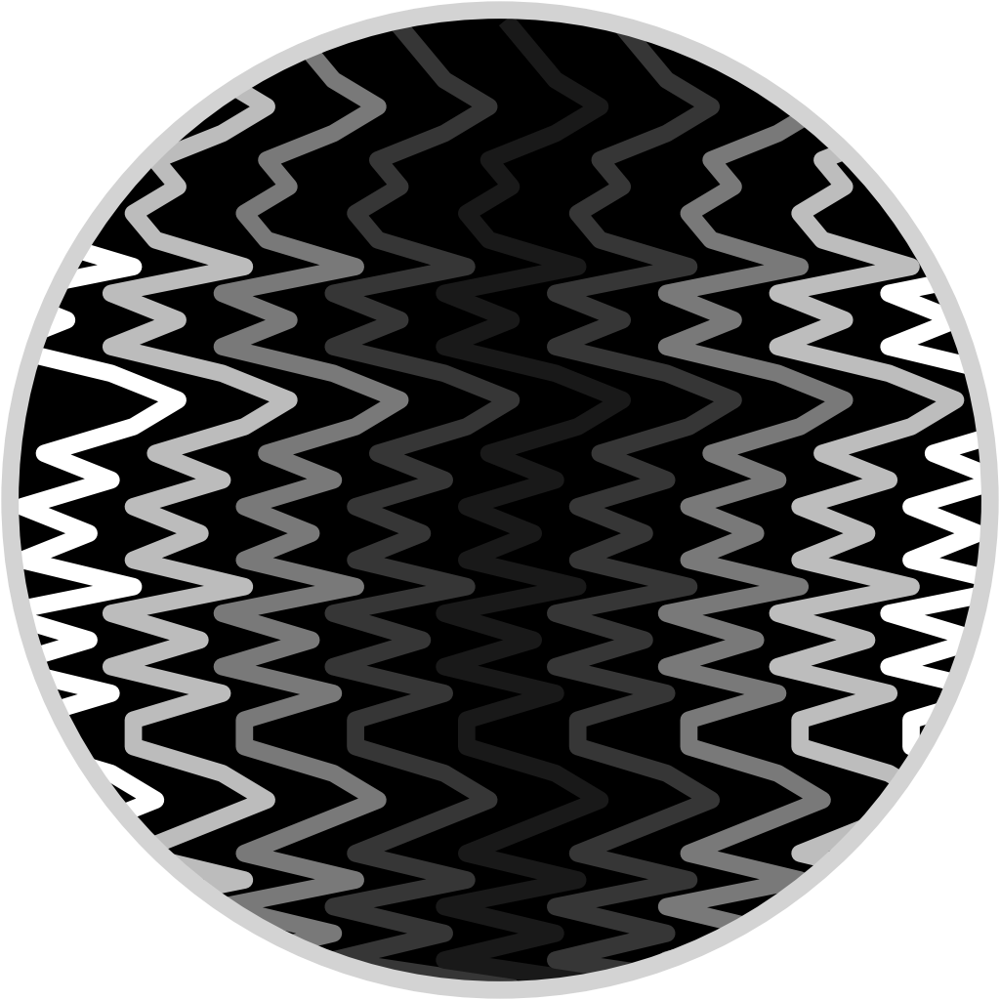

.. straditize documentation master file

.. _straditize:

Digitizing stratigraphic diagrams
=================================

.. only:: html and not epub

    .. start-badges

    .. list-table::
        :stub-columns: 1
        :widths: 10 90

        * - docs
          - |docs|
        * - tests
          - |travis| |appveyor| |codecov|
        * - package
          - |version| |conda| |joss| |github|
        * - implementations
          - |supported-versions| |supported-implementations|

    .. |docs| image:: http://readthedocs.org/projects/straditize/badge/?version=latest
        :alt: Documentation Status
        :target: http://straditize.readthedocs.io/en/latest/?badge=latest

    .. |travis| image:: https://travis-ci.org/Chilipp/straditize.svg?branch=master
        :alt: Travis
        :target: https://travis-ci.org/Chilipp/straditize

    .. |appveyor| image:: https://ci.appveyor.com/api/projects/status/c1c8pqvh8h8rolxw?svg=true
        :alt: AppVeyor
        :target: https://ci.appveyor.com/project/Chilipp/straditize/branch/master

    .. |codecov| image:: https://codecov.io/gh/Chilipp/straditize/branch/master/graph/badge.svg
        :alt: Coverage
        :target: https://codecov.io/gh/Chilipp/straditize

    .. |version| image:: https://img.shields.io/pypi/v/straditize.svg?style=flat
        :alt: PyPI Package latest release
        :target: https://pypi.python.org/pypi/straditize

    .. |conda| image:: https://anaconda.org/conda-forge/straditize/badges/version.svg
        :alt: conda
        :target: https://anaconda.org/conda-forge/straditize

    .. |supported-versions| image:: https://img.shields.io/pypi/pyversions/straditize.svg?style=flat
        :alt: Supported versions
        :target: https://pypi.python.org/pypi/straditize

    .. |supported-implementations| image:: https://img.shields.io/pypi/implementation/straditize.svg?style=flat
        :alt: Supported implementations
        :target: https://pypi.python.org/pypi/straditize

    .. |joss| image:: http://joss.theoj.org/papers/10.21105/joss.01216/status.svg
        :alt: Journal of Open Source Software
        :target: https://doi.org/10.21105/joss.01216

    .. |github| image:: https://img.shields.io/github/release/Chilipp/straditize.svg
        :target: https://github.com/Chilipp/straditize/releases/latest
        :alt: Latest github release

    .. end-badges

STRADITIZE (Stratigraphic Diagram Digitizer) is an open-source program that
allows stratigraphic figures to be digitized in a single semi-automated
operation. It is designed to detect multiple plots of variables analyzed along
the same vertical axis, whether this is a sediment core or any similar
depth/time series.

Usually, in an age of digital data analysis, gaining access to data from the
pre-digital era – or any data that is only available as a figure on a page –
remains a problem and an under-utilized scientific resource.

This program tackles this problem by providing a python package to digitize
especially pollen diagrams, but also any other type of stratigraphic diagram.

The package is very new and there are many features that will be included in
the future. Therefore we would be very pleased to get feedback! To do so, you
can contact us or raise an issue on
`GitHub <https://github.com/Chilipp/straditize>`__.

Documentation
-------------

.. toctree::
    :maxdepth: 1

    about
    installing
    tutorial/index
    contribute
    command_line
    gui/straditize
    api/straditize
    changelog

.. _citation:

How to cite straditize
----------------------

When using straditize, you should at least cite the publication in
`the Journal of Open Source Software`_:

.. only:: html and not epub

    .. image:: http://joss.theoj.org/papers/10.21105/joss.01216/status.svg
        :alt: Journal of Open Source Software
        :target: https://doi.org/10.21105/joss.01216

    .. image:: https://zenodo.org/badge/128653545.svg
       :alt: zenodo
       :target: https://zenodo.org/badge/latestdoi/128653545

Sommer, Philipp, Dilan Rech, Manuel Chevalier, and Basil A. S. Davis. Straditize: Digitizing Stratigraphic Diagrams. *Journal of Open Source Software* , vol. 4, no. 34, 34, The Open Journal, Feb. 2019, p. 1216, doi:10.21105/joss.01216, https://doi.org/10.21105/joss.00363.

:download:`BibTex <straditize_entry.bib>` - :download:`EndNote <straditize_entry.enw>`

Furthermore, each release of straditize is
associated with a DOI using zenodo.org_. If you want to cite a specific
version or plugin, please refer to the `releases page of straditize`_.

.. _the Journal of Open Source Software: http://joss.theoj.org/
.. _zenodo.org: https://zenodo.org/
.. _releases page of straditize: https://github.com/Chilipp/straditize/releases/

Indices and tables
==================

* :ref:`genindex`
* :ref:`modindex`
* :ref:`search`
