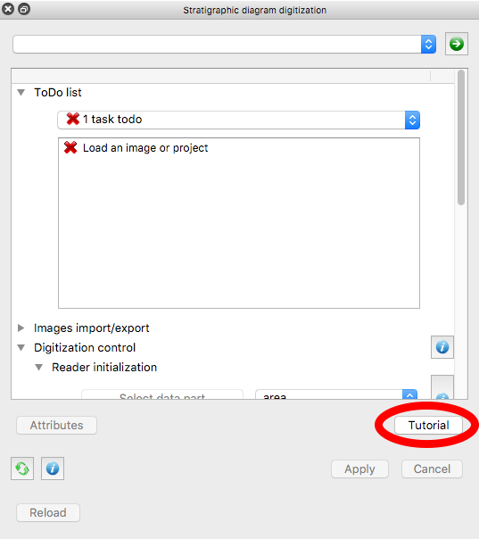

.. _tutorial:

Straditize Tutorial
===================
To introduce you into straditize, we implemented a tutorial into the graphical
user interface.

To start it in the GUI, click the :guilabel:`Tutorial` button at the bottom of
the straditizer control.

Tutorials
---------

.. toctree::
    :maxdepth: 1
    :hidden:

    beginner/beginner-tutorial-intro
    hoya-del-castillo/hoya-del-castillo-tutorial-intro

.. raw:: html

    

.. only:: html

    .. figure:: /tutorial/thumb/beginner-tutorial-thumb.png

        :ref:`beginner-tutorial`

.. raw:: html

    

.. raw:: html

    

.. only:: html

    .. figure:: /tutorial/thumb/hoya-del-castillo-thumb.png

        :ref:`area-tutorial`

.. raw:: html

    

