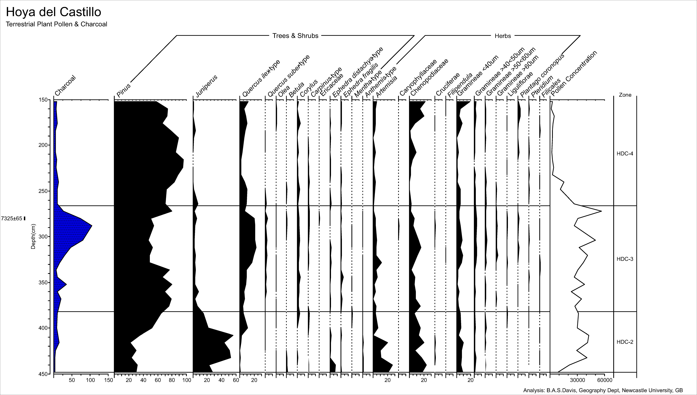

# Summary

In an age of digital data analysis, gaining access to data from the pre-digital
era – or any data that is only available as a figure on a page – remains a
problem and an under-utilized scientific resource. Whilst there are numerous
programs available that allow the digitization of scientific data in a simple
x-y graph format, we know of no semi-automated program that can deal with data
plotted with multiple horizontal axes that share the same vertical axis, such
as pollen diagrams (see image below) and other stratigraphic figures that are
common in the Earth sciences. `Straditize` (Stratigraphic Diagram Digitizer)
[@Sommer2019] fills this gap. It is an open-source program that allows
stratigraphic figures to be digitized in a single semi-automated operation. It
is designed to detect multiple plots of variables analyzed along the same
vertical axis, whether this is a sediment core or any similar depth/time
series.

{ width=80% }

The program supports mixtures of many different
diagram types, such as bar plots, line plots, as well as shaded, stacked, and
filled area plots. Other features of `straditize` include text recognition to
interpret the names of the different plotted variables, the automatic and
semi-automatic recognition of picture artifacts, as well an automatic
measurement finder to exactly reproduce the data that has been used to create
the diagram.

`Straditize` is written in the programming language Python and is available for
Windows, Linux and MacOS. Being implemented in the visualization framework
psyplot [@Sommer2017] it provides an extensively documented graphical
user interface for a point-and-click handling of the semi-automatic process,
but can also be scripted or used from the command line. The visualization is
based on matplotlib [@Hunter2007] and most of the detection algorithms
use image recognition functions from the scikit-image package [@Walt2014] and
numeric routines from scipy [@Jones2001] and numpy [@Oliphant2006].

# Acknowledgements

We gratefully acknowledge funding by the Swiss National Science Foundation
(SNF) through the HORNET project (200021_169598).

# References
