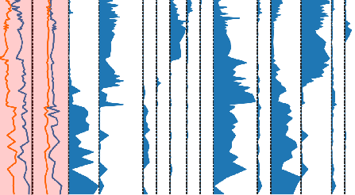

.. _child-readers:

Column specific readers
=======================

.. note::

    If the entire diagram is just based on one diagram type (see
    :ref:`select-reader`), you can skip this step.

As noted in the :ref:`reader selection section <select-reader>`, you can
choose different readers for different columns in order to account for multiple
subdiagram styles within the stratigraphic diagram. The current reader, i.e.
the one that is selected in the `Current reader` tab in the
`Digitization control` is the one that can be accessed via the
``stradi.data_reader`` attribute in the console. It is also sometimes referred
to as the `parent reader`.

Clicking the :guilabel:`+` button in the `Current reader` tab let's you select
columns just by clicking on the data image.

After you selected the necessary columns, hit the :guilabel:`Apply` button. In
the appearing window, select the reader type you want (see
:ref:`select-reader`). You now initialized a new child reader for the selected
columns that can be set as the parent reader using the dropdown menu in the
`Current reader` tab.
