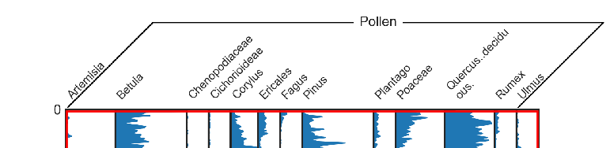
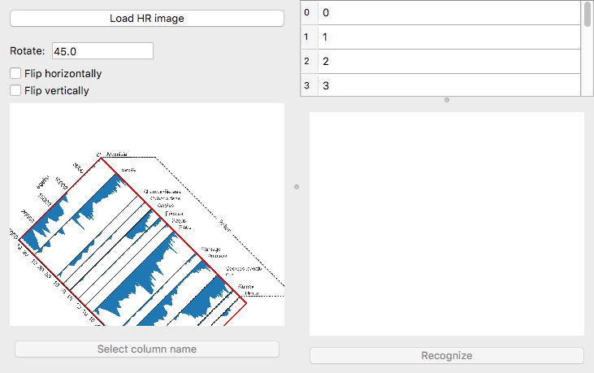
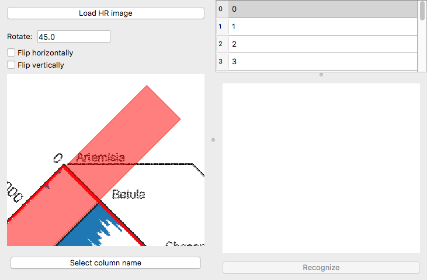
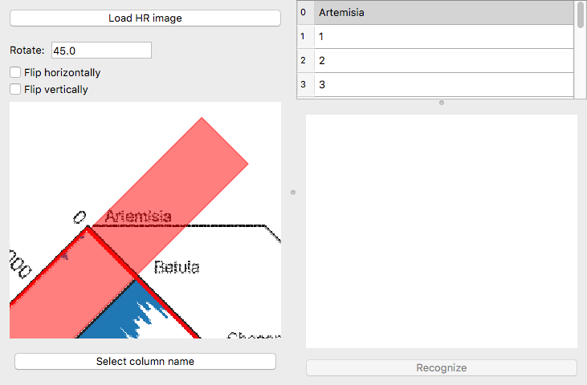
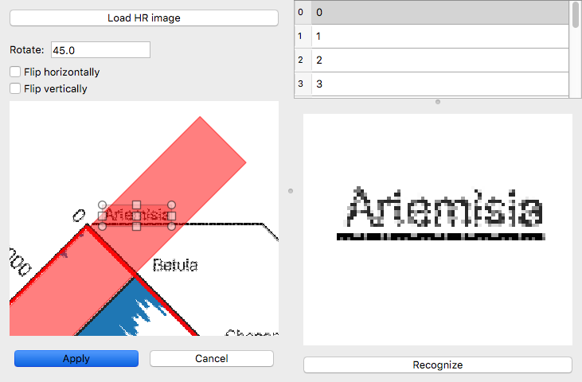
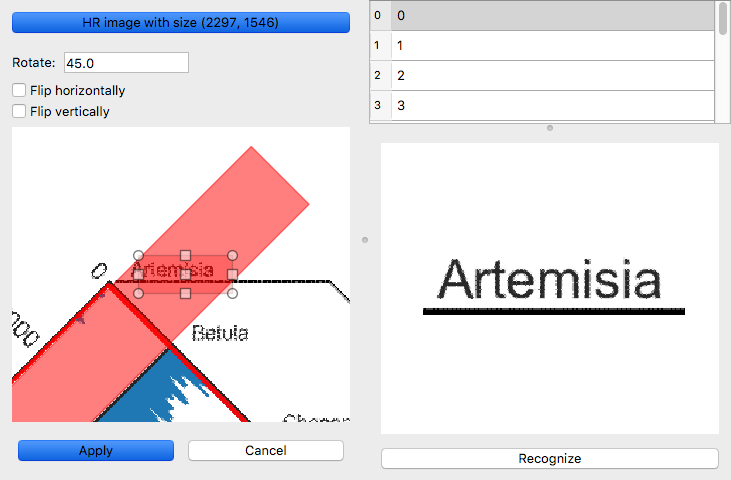
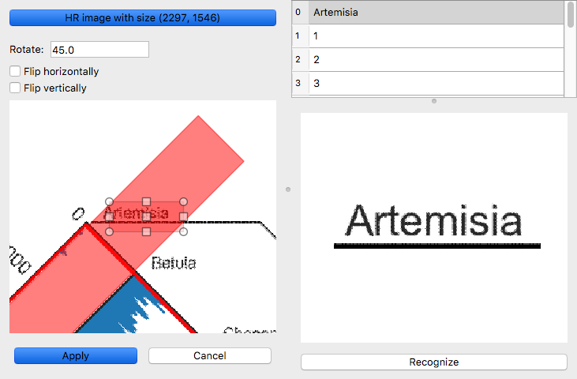

.. _colnames:

Handling column names
=====================
Within straditize, you can assign a name to each of the columns in your
diagram, which will then turn up as the header in your final export. Usually
these names are the titles of your columns, e.g. such as here

To enter the names of the columns, hit the :guilabel:`Edit column names` button
in the *Column names* section of the straditizer control. This will open a
dialog to handle the column names:

On the left side, you have a rotated version of the image that you can control
with the options above it. To navigate in this window, place your
mouse over it and then you can move (pan) the image with left-click.

Zooming in and out is done via right-click. To zoom in, hold your right mouse button and move
your cursor to the upper right corner of your diagram. To zoom out, move it to
the lower left corner.

On the right side you have a table with the column names. Initially, these are
just increasing numbers starting from 0 for your first column. If you select
one column, it will be highlighted in the left image:

You can now enter the name of the column, in this case Artemisia

.. _colnames-ocr:

Automatic optical character recognition (OCR)
---------------------------------------------
You don't have to type the column name, you can also use the builtin text
recognition. For this, we rely on the tesseract_ software that can be
installed (on linux and MacOS) via::

    conda install -c conda-forge tesseract

see the `tesseract feedstock`_ on conda-forge. If you want to automatically
find the column names, you also need tesserocr_ to be installed which can be
done via::

    pip install tesserocr

or::

    conda install -c chilipp tesserocr  # on linux/MacOS

(see https://pypi.org/project/tesserocr/ for more installation options, in
particular for Windows).

1. Use a high resolution version of the image
^^^^^^^^^^^^^^^^^^^^^^^^^^^^^^^^^^^^^^^^^^^^^
To improve the result of the text recognition, we recommend to use a sufficient
resolution of about 600 dpi. If the image that you are digitizing does not have
this resolution, you can optionally load a higher resolution version of it
using the :guilabel:`Load HR image` button at the upper left of the dialog.

We also recommend to remove everything in this file but the column names to
improve the text recognition.

2. Automatically find all column names
^^^^^^^^^^^^^^^^^^^^^^^^^^^^^^^^^^^^^^
Check the `all columns` checkbox and click the :guilabel:`Find column names`
button. This then will look for column names in the image that is displayed
on the left of the table and insert them into the table.

3. Separate treatment of column names
^^^^^^^^^^^^^^^^^^^^^^^^^^^^^^^^^^^^^
Now, select the first column in the table, zoom in such that you can see
the name of the first column and click the :guilabel:`Select column name`
button.

You won't be able to zoom or pan in your plot anymore, but you can now draw a
rectangle in the plot around the name of the first column or use click the
:guilabel:`Find column names` button (without having the `all columns`
checkbox checked) and it will show up in the plot on the lower right of the
diagram.

Here you see the result of the low resolution. If we instead specify a higher
resolution image (see above), this can look much better

Now click the :guilabel:`Recognize` button at the bottom and it will use
tesseract to read the text in the image and fill in the table

You can now select the next column or click the :guilabel:`Apply` button on the
lower left. The latter will reenable the navigation (pan and zoom) in the plot.

.. _tesseract: https://github.com/tesseract-ocr/tesseract
.. _tesseract feedstock: https://github.com/conda-forge/tesseract-feedstock
.. _tesserocr: https://pypi.org/project/tesserocr/
