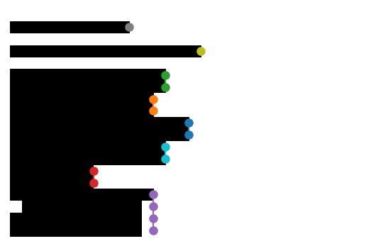

.. include:: <isonum.txt>

.. _digitize:

Digitizing the diagram
======================
The digitization transforms your picture into a table. The outcome is a
data frame with one value for each row and column in the data part of your
image. After the digitization, you can access this raw data from the command
line via::

    stradi.data_reader.full_df

and you can plot it using the `Full digitized data` item in the
:ref:`plot control <plot-control>`.

The digitization procedure depends on the reader type that you are using (see
:ref:`select-reader`).

.. contents::

.. _digitizing-area:

Digitizing area and line readers
--------------------------------

This class of stratigraphic diagrams is the most popular within the pollen
diagrams and it's digitization is fully automatic.

The algorithm simply uses the distance of the most right data (black) pixel to
the column start.

.. _digitizing-bars:

Digitizing bars
---------------

For digitizing bar diagrams, it is crucial that the software finds
and distinguishes adjacent bars. This is mainly done through the `tolerance`.
The algorithm is: if the pixel row, compared to the previous row, is higher or
smaller by the given `tolerance` , the software assumes that those two rows
belong to two distinct bars.

The image above illustrates this. The reader distinguishes the bars that are
clearly separated or were one bar is significantly lower or higher than the
other, but it cannot distinguish bars were there is only a small difference in
height.

Splitting bars
**************

.. table::
    :widths: auto

    +--------------+--------+--------------+
    | |splitting1| | |rarr| | |splitting2| |
    +--------------+--------+--------------+

To overcome this problem, straditize automatically finds the bars that are
wider than the others and marks them for splitting. If the straditizer finds
bars that are too long, they are shown in the `Split too long bars` tab of the
digitization control. To split one bar:

1. Double-click an item in the table (the plot will zoom to the bar)
2. Left-click on the bar to indicate the vertical location for a split
   (right-click again on the same line to revert this). A red line will appear
   (left-click, see image above) or disappear (right-click)
3. Click the |next-bar| symbol to continue with the next bar that is too long
   or double-click an item in the table. Again split the bar as described in 2.
4. When you are done, hit the :guilabel:`Apply` button and the bars will be
   splitted right were you marked it

.. |next-bar| image:: next_bar.png
    :width: 1em

.. _digitizing-stacked:

Digitizing stacked areas
------------------------

.. table::
    :widths: auto

    +--------+------------+--------+------------+
    |        | initial    |        | column 1   |
    +--------+------------+--------+------------+
    |        | |stacked0| | |rarr| | |stacked1| |
    +--------+------------+--------+------------+
    |        | column 2   |        | column 3   |
    +--------+------------+--------+------------+
    | |rarr| | |stacked2| | |rarr| | |stacked3| |
    +--------+------------+--------+------------+
    |        | column 4   |        | column 5   |
    +--------+------------+--------+------------+
    | |rarr| | |stacked4| | |rarr| | |stacked5| |
    +--------+------------+--------+------------+

Stacked diagrams are more difficult to digitize because of the variety of
combinations. The columns might be distinguished by colors or patterns
(hatches). Therefore, the user has to select the features corresponding to one
column, one after the other.

The digitization here works as follows:

1. click the :guilabel:`Digitize` button, you will see a control for navigating
   within the columns

   .. image:: stacked-digitization-control.png

2. click the :guilabel:`+` button to setup a new column. Everything in the
   column will be selected and now you have to select only
   those features, that are part of the first column using the
   selection tools (see the `column 1` above).
3. When you did this, click the :guilabel:`Apply` button.
4. click the :guilabel:`Edit` button if you want to edit the column that you
   just selected
5. Click the :guilabel:`>` button to go to the right column
6. click the :guilabel:`+` to add a  new column and select the second column
   (see above)
7. repeat the steps 3-6 until you digitized all columns

If you want to display your digitization result, use the
`Full digitized data` in the :ref:`plot control <plot-control>`.

.. hint::

    you can change the transparency of the selection with the transparency
    slider in the :ref:`selection toolbar <selection-toolbar>`. That helps to
    still see the selected features
