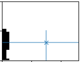
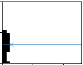

.. include:: <isonum.txt>

.. _find-measurements:

Editing measurements
====================
To edit measurements, click the :guilabel:`Edit measurements` button and a new
figure will be created with one mark for each measurement and a table is shown
to you with the measurements data. To edit the measurements, you can edit the
table or the marks in the plots

The measurement table
---------------------
.. image:: measurements-editor.png

The measurement table shows you the vertical coordinates of the
measurements and the values for each column obtained through the digitization.

Each row in this table represents one measurement in the diagram.

The first column is the vertical location (y-axis) of the measurement, the
remaining columns are the x-values of the measurements. The numbers shown in
the table are in pixel coordinates of the diagram part. To interact with the
measurements, you can

1. Right click the table to add new or delete old measurements/rows below or
   above the selected row
2. Edit the numbers in the cells to change the values for the measurements.
3. Fit the x-values of the measurements to the data.

   i. Either by right-click  and `Fit selected cells to the data`, which will
      adjust the column values of the mark such, that it fits with the
      digitized value

      .. table::
          :widths: auto

          +--------------+--------+----------------+
          |   original   |        | fitted to data |
          +--------------+--------+----------------+
          | |displaced|  | |rarr| |  |corrected|   |
          +--------------+--------+----------------+
   ii. Or by using the `Fit selected cells to selected data` checkbox. If this
       is checked:

       1. select cells in the table
       2. click on the plot
       3. the cells will be updated with the x-values from the digitization at
          the click-position

You can also zoom the selection or hide everything else but the selection.

Editing the marks
-----------------
.. image:: edit-measurements-marks.png

Additional to the table, you have a visual representation of the measurements
in the figure. Here, you have one plot per column  each mark represents the
vertical location of a measurement. The marker ``x`` in the line shows you the
value of the measurement (i.e. the location on the x-axes).

1. move a measurement by

   i. left-click a mark and hold the mouse button (the mark will change it's
      color)
   ii. while still holing the mouse button, drag the mark to a different
       location
2. delete a measurement by right-clicking the mark
3. add a new measurement by holding down the :kbd:`Shift` button and left-click
   on one of the plots.
