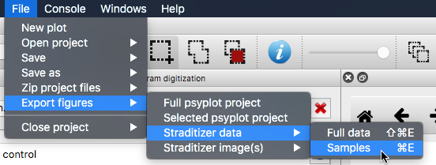

.. _export:

Export your results
===================
Once you found the samples and added the y-axis and x-axis transformations,
you can export them to a comma-separated (CSV) or an Excel file.

Just use the export menu via

:menuselection:`File --> Export figures --> Straditizer data --> Samples`

.. only:: html

    or hit :kbd:`Control-E` (:kbd:`⌘-E` on MacOS)

.. only:: not html

    or hit :kbd:`Control-E` (:kbd:`Command-E` on MacOS)

If you want to export the full digitized data, i.e. not only the samples, use

:menuselection:`File --> Export figures --> Straditizer data --> Full data`

.. only:: html

    or hit :kbd:`Shift-Control-E` (:kbd:`⇧-⌘-E` on MacOS)

.. only:: not html

    or hit :kbd:`Shift-Control-E` (:kbd:`Shift-Command-E` on MacOS)
