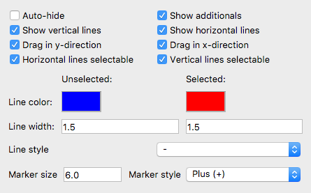

.. _marker-control:

Configuring the appearance of markers
=====================================
In the digitization, you will work with markers to select parts of your image.
These can be the marks to :ref:`select the diagram part <select-data>`, to
:ref:`separate the columns <col-starts>` or to
:ref:`edit your samples <edit-samples>`.

You can modify the appearance of the marks using the :guilabel:`Marker control`
section in the straditization control. This helps you to better visualize and
select different parts in the diagram.

The functionalities are

:guilabel:`Auto-hide`
    Hide the lines of the marks, when they are not selected
:guilabel:`Show additionals`
    When :ref:`editing the samples <edit-samples>`, for example, you will also
    see the rough locations of the samples for each column (little grey
    crosses). With the `Show additionals` setting, you can hide or show them
:guilabel:`Show vertical lines` and :guilabel:`Show horizontal lines`
    If your marks are crosses, e.g. when you are
    :ref:`selecting the diagram part <select-data>`, you can hide and show
    the vertical or horizontal lines with these settings
:guilabel:`Drag in y-direction` and :guilabel:`Drag in x-direction`
    If unchecked, a mark cannot be moved along the corresponding axes. You can
    use this option, if you want to change the y-value of a mark without
    changing the x-value (or the other way around)
:guilabel:`Horizontal lines selectable` and :guilabel:`Vertical lines selectable`
    If you uncheck one of these, you can prevent selecting a mark from the
    horizontal or vertical position. By default, you can select and move/drag
    a mark, by clicking on either of the lines (horizontal or vertical). But,
    for example, when editing the samples, many marks may lie on the same
    vertical position. Therefore it can be hard to move the mark of interest
    if you're selecting the vertical line of the mark.
:guilabel:`Line color`
    This changes the color of all marks.
:guilabel:`Line width`
    This changes the line width of the marks. Sometimes it is better, if the
    linewidth increases when you are selecting a line
:guilabel:`Line style`
    You can change the style of the lines, to a dotted line, dashed line, etc.
:guilabel:`Marker size` and :guilabel:`Marker style`
    The location of the marks, i.e. where vertical and horizontal lines
    intersect, e.g. on corner of the diagram when
    :ref:`selecting the diagram part <select-data>`, has a marker associated
    with it. It shows you, where the corner of your diagram is, where the
    sample value is, etc.. To make this more visible, you can change the size
    and the appearance of the mark.
