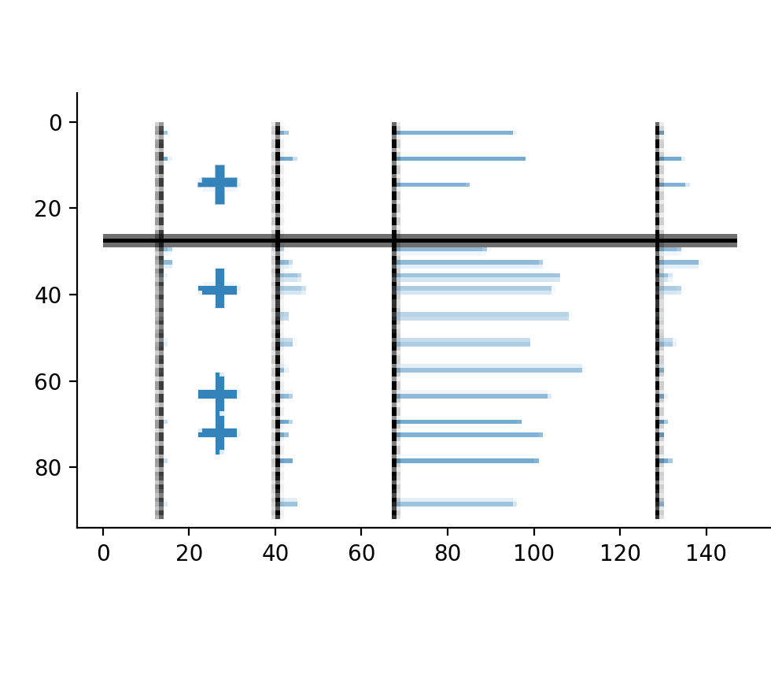

.. _occurences:

Select occurences
=================
Pollen diagrams often mark low taxon percentages to highlight the occurence
of a taxon, such as the ``+`` in the image below

This is very useful information which can be considered by straditize.

1. Expand the *Occurences* tab in the *Digitization control* section
2. Click the :guilabel:`Select occurences` button and select the occurences
   using the tools from the :ref:`selection toolbar <selection-toolbar>`,
   especially the |select-pattern| tool is useful

   .. image:: selected-occurences.png
       :alt: selected occurences

3. Click the :guilabel:`Apply button` and the selected features in the diagram
   will be registered as an *occurence*. If you also checked the
   `Remove on apply` checkbox next the to :guilabel:`Select occurences` button
   (which you normally should), the selected features in the diagram will be
   removed, too and you will end up with a plot like this

   .. image:: removed-occurences.png
       :alt: removed occurences

4. You can see and edit the occurences using the :guilabel:`Edit occurences`
   button. This will create horizontal markers at the positions of the original
   occurences

   .. image:: edit-occurences.png
       :alt: Editing of occurences

   In our demonstration, straditize could not distinguish two of the occurence
   markers because they were too close to each other. But you can just move the
   mark with Left-click and Shift+Leftclick on the plot to create a new marker

   .. image:: edited-occurences.png
       :alt: Edited occurences

   Click the :guilabel:`Apply` button when you are done.

5. The marked occurences will appear later in the final data frame with the
   specified *Occurence value*.

.. |select-pattern| image:: pattern.png
   :width: 1.3em
