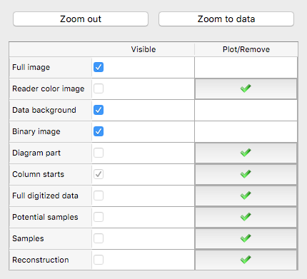

.. _plot-control:

Visualize your progress with the plot control
=============================================
To explore and validate your digitization, straditize implements multiple
ways to visualize the results. You can show and remove these static
visualizations using the items in the plot control.

Here you can hide the several plot objects using the :guilabel:`Visible`
checkbox or you can plot the objects by clicking the |plot| button or remove
it by clicking the |remove| button.

.. note::

    Please note, that these are static plots. So if you change your data, e.g.
    through modifying the column starts, you have to remove (|remove|) and
    plot (|plot|) the `Column starts` item to visualize the changes.

Some of the plotting features only visualize the currently selected columns.
So if you have :ref:`column-specific readers <child-readers>` or
:ref:`exaggerations <exaggerations>`, these options hide and show the plots for
the currently selected columns only.

Full image:
    The full image is the diagram, that you are digitizing
Reader color image:
    This is the diagram part of the currently selected columns in color.
Data background:
    This is just a white layer that lies over the `Full image` in the diagram
    part. If you want to see the diagram part in the `Full image`, you have
    to hide this layer
Binary image:
    This is the image that is used to digitize the diagram part. As with the
    `Reader color image`, this option shows/hides the binary image for the
    currently selected columns.
Diagram part:
    This draws a red rectangle around the `diagram part` (see the
    :ref:`terminology`)
Column starts:
    Red lines showing you, where each column starts of out of the currently
    selected columns starts
Full digitized data:
    After having hit the :guilabel:`Digitize` button, you can visualize the
    full digitized data for the currently selected columns.
Potential samples:
    For each column, we identify rough locations where samples may lie (see
    :ref:`find-samples`). This plot option lets you visualize these.
Samples:
    This option draws horizontal lines to show, the sample locations
Reconstruction:
    This plot option draws one line for each column, as the
    `Full digitized data` does, but it uses only the x- and y-values at the
    sample locations.

.. |plot| image:: valid.png
    :width: 1.3em

