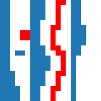
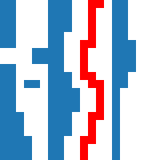
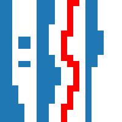

.. _remove-disconnected:

Remove disconnected features
============================
This function automatically recognizes features that are disconnected either
from the column start or from the previous feature in the column.

That can be useful, for example, to remove letters or symbols in the diagram.

What features are recognized can be defined in three ways:

1. Features that have a certain distance from the column start (see
   :ref:`disco-from0`
2. Features that have a certain distance from the previous
   feature in the column (see :ref:`disco-fromlast`)
3. A combination of 1. and 2. (see :ref:`disco-both`)

.. _disco-from0:

Disconnected from the column start
----------------------------------
When only the checkbox *from column start* is checked, all features that
have the given distance from the column start are selected.

.. _disco-fromlast:

Disconnected from the previous feature
--------------------------------------
When only the checkbox *from previous feature* is selected, all features
that have the given distance from the previous feature in the column (and
everything to the right of it) is selected.

.. _disco-both:

Disconnected from start and previous
------------------------------------
If both are selected, the selected feature must have the given distance
from the column start and from the previous feature in the column to be
selected.

