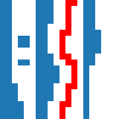

.. _remove-features:

Removing features
=================
The diagram part is converted to a binary image where everything black
(i.e. 1) represents data (see :ref:`select-reader`). So before the data is
digitized, features that do not represent data have to be removed.

Here, you can either use the
:ref:`features of the selection toolbar <selection-toolbar>`,
or you use one of the automatic removal tools we provide here. Note that you
can edit every selection using the
:ref:`mouse selection tools <mouse-selection-tools>` or the
:ref:`automatic tools <auto-tools>` from the selection toolbar.

After you selected the features to remove, click the :guilabel:`Remove` button
at the bottom of the straditizer control panel.

+------------------------------------------------------------+-----------------------------------------------------+
| :ref:`horizontal lines <remove-lines>`                     | :ref:`vertical lines <remove-lines>`                |
+------------------------------------------------------------+-----------------------------------------------------+
|                   |hlines|                                 |                    |vlines|                         |
+------------------------------------------------------------+-----------------------------------------------------+
| :ref:`features at column ends <features-at-column-ends>`   | :ref:`disconnected features <remove-disconnected>`  |
+------------------------------------------------------------+-----------------------------------------------------+
|                    |col-ends|                              |                    |disco|                          |
+------------------------------------------------------------+-----------------------------------------------------+
| :ref:`cross column features <cross-column>`                | :ref:`small artifacts <remove-small>`               |
+------------------------------------------------------------+-----------------------------------------------------+
|                   |cross-col|                              |                     |small|                         |
+------------------------------------------------------------+-----------------------------------------------------+

.. |vlines| image:: basic_diagram_vlines.png

.. |col-ends| image:: basic_diagram_features_at_col_ends.png

.. |small| image:: basic_diagram_small_features.png

.. toctree::
    :hidden:

    remove_col_ends.rst
    remove_cross_column.rst
    remove_disconnected_parts.rst
    remove_lines.rst
    remove_small_parts.rst
