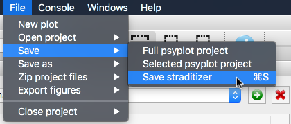

.. _save-and-load:

Saving and loading your project
===============================

.. _save:

Saving a project
----------------
You can always save your current state to your hard-disc and continue working
at it at a later point. To save a project, click
:menuselection:`File --> Save --> Save straditizer`

.. only:: html

    or hit :kbd:`Control-S` (:kbd:`⌘-S` on MacOS)

.. only:: not html

    or hit :kbd:`Control-S` (:kbd:`Command-S` on MacOS).

This will save your project, or, if you never saved it before or used the
`Save As` option, it will open a file dialog to let you select the target
location.

The default and recommended way is to save it is a netCDF_ file (ending with
``.nc`` or ``.nc4``). This is a common self-describing, machine-independent
data format that supports the creation, access, and sharing of array-oriented
scientific data. We recommend this format, because it works independent of the
python libraries that you are using and let's you easily share the project with
others or copy it to another machine.

The other possibility is to save it as a pickle (``.pkl``) file which uses the
built-in :mod:`pickle` module to save the straditizer to a file. The reason,
why we generally do not recomment this, is because the saved file might not
work anymore if you upgrade your libraries (e.g. ``numpy``, ``pandas`` or
``pillow``).

.. _netCDF: https://en.wikipedia.org/wiki/NetCDF

.. _load:

Loading a project
-----------------
Reloading the project works the same way as you open a new image file (see
:ref:`load_image`). Just go to
:menuselection:`File --> Open project --> Open straditizer --> Project or image`
and choose the project file to load (or use the |arrow| button at the top of the
straditizer control). If the chosen file ends with ``.nc``, ``.nc4`` or
``.pkl``, straditize will recreate the given project.

.. |arrow| image:: run_arrow.png
    :width: 1.3em
