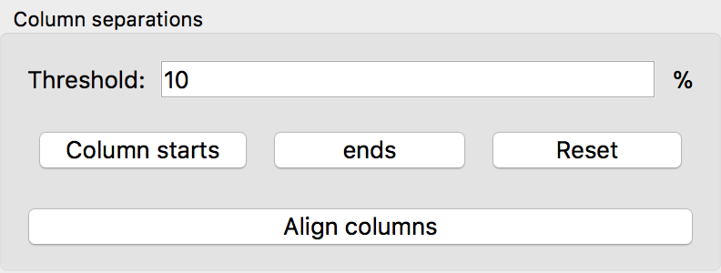

.. _col-ends:

Select the ends for each column
===============================
A pollen diagram is defined through different columns, each column
represents one taxa, species, PFT, etc.. To digitize the data, we have to know,
where each column starts and ends exactly.

After having clicked the :guilabel:`Column starts` button, the software
automatically estimates the starts of the columns and, based on that, the
column ends as well. Clicking the :guilabel:`ends` button however lets
you modify the automatically estimated column ends.

As for the :ref:`column starts <col-starts>`, there are two ways to modify
the column ends:

1. Hold the :kbd:`Shift` button and left-click on the plot to create a
   new vertical mark.

   Then Left-click the mark and drag it to the start of one column.
2. Delete a column start by right-clicking the mark.

.. seealso::

    - :ref:`align-cols`
    - :ref:`col-starts`
