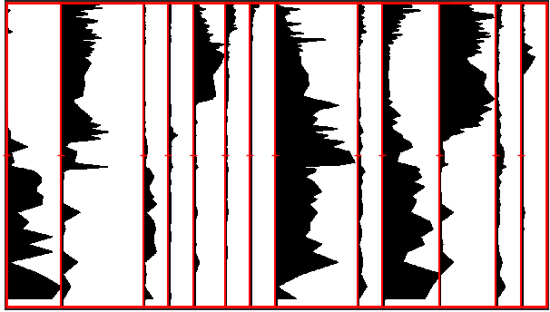
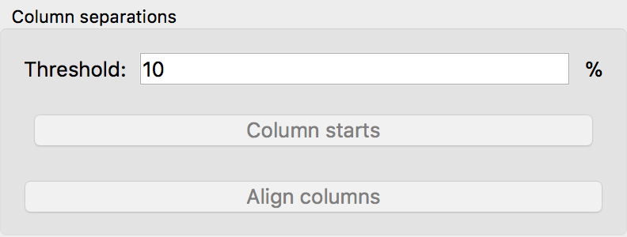

.. _col-starts:

Select the starts for each column
=================================

A stratigraphic diagram is defined through different columns, each column
represents one variable (or for pollen diagrams, one taxa, species, PFT, etc.).
To digitize the data, we have to know, where each of these column starts
exactly.

After having clicked the :guilabel:`Column starts` button, the software
automatically estimates the starts of the columns. However, you should check
whether they are all recognized correctly.

There are several possibilities to edit the automatically estimated columns:

1. Hold the :kbd:`Shift` button and left-click on the plot to create a
   new vertical mark.

   Then Left-click the mark and drag it to the start of one column.
2. Delete a column start by right-clicking the mark.
3. Modify the `threshold`. It defines the percentage of a pixel column that has
   to be covered to assume a valid column start. If you have columns that only
   contain a very small amount of data, you should lower it

.. seealso::

    .. toctree::

        select_column_ends
        align_columns
