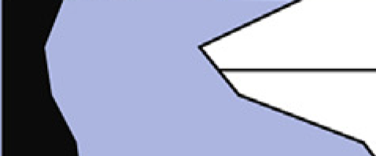
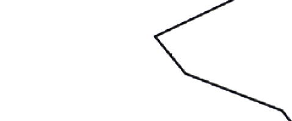
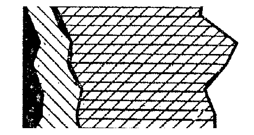

.. _select-reader:

Selecting the reader
====================
Stratigraphic diagrams and especially pollen diagrams come in different styles
and formats.

Straditize supports the following:

+---------------------+---------------------+---------------------+
|     **area**        |     **bars**        |   **rounded bars**  |
+---------------------+---------------------+---------------------+
|      |area|         |      |bars|         |    |rounded bars|   |
+=====================+=====================+=====================+
|     **line**        |  **stacked area**   |                     |
+---------------------+---------------------+---------------------+
|      |line|         |    |stacked|        |                     |
+---------------------+---------------------+---------------------+

For each type there exists a specific reader that you can select from the
drop down menu in the `Reader initialization` section of the straditizer
control. If you're diagram contains a mixture of types, just choose one type
for now and you can then later
:ref:`create column specific readers <child-readers>`.

After you chose the :ref:`diagram part <select-data>` and selected the
reader type (see the table above), you can now click the
:guilabel:`Convert image` button. This initializes the reader and converts the
data image to a binary image, i.e. black and white.

Everything that is black in this image will be considered as data by the
reader. So the next steps will include, cleaning up the image and removing
unimportant parts.

