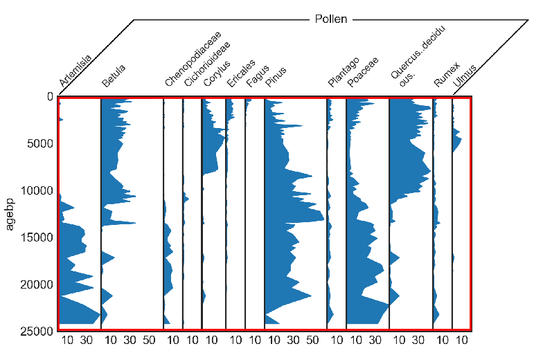

.. include:: <isonum.txt>

.. _terminology:

Basics and Terminology
======================

A stratigraphic diagram consists of multiple diagrams that are vertically
or horizontally aligned, i.e. that have either the same x- or y-axis.

This software assumes, that all the subdiagrams share the y-axis, i.e. the
vertical axis. If this is not the case for your specific diagram, just rotate
your image by 90\ |deg|\ .

column
    One column in the diagram means one of the subdiagrams (e.g. *Betula* in
    the example diagram above). The total number of columns is the number
    of subdiagrams in your plot.
pixel column
    One pixel column is the horizontal pixel index (x-axis), ranging from 0 to
    the width of your image. Pixel column 0 represents all pixels on the very
    left side.
row or pixel row
    One pixel row (or sometimes only *row*) is the vertical pixel index
    (y-axis), ranging from 0 to the height of your image. Row 0 represents all
    pixels at the top.
diagram part
    This is the part where the data is shown (red rectangle in the figure
    above).
binary image
    The binary image is the diagram part converted to black (1) and white (0).
    Every black pixel in this binary image represents data that should be
    digitized.
digitize
    Digitization means transforming each pixel into a value (see the blue line
    in the image above). Therefore, in contrast to the samples, you get
    one data value for each pixel row in the binary image. We also refer to this
    as the `full data`.

    .. image:: digitize-vs-sample.png
        :width: 50%
        :align: center
sample
    The samples (red lines in the image above) are a subset of the
    digitization result. In a very basic sense, the samples represent the
    original data that was used to create the diagram. In a sediment core for a
    pollen diagram, it would be one slice of the core that was analyzed under
    the microscope.
straditizer
    Everything that refers to the straditizer refers to the full image of your
    stratigraphic diagram. Speaking in a programmatically sense, it is the
    top-level interface to digitize the diagram, an instance of the
    :class:`straditize.straditizer.Straditizer` class. You can always access
    the current straditizer through the ``stradi`` variable in the ipython
    console of the GUI
reader or data reader
    This is the object that digitizes the diagram part (red area above). For
    different diagram types (area plot, bar plot, etc.) you have different
    readers with different functionalities.

    The reader of your diagram can be accessed via typing
    ``stradi.data_reader`` in the ipython console of the GUI.
