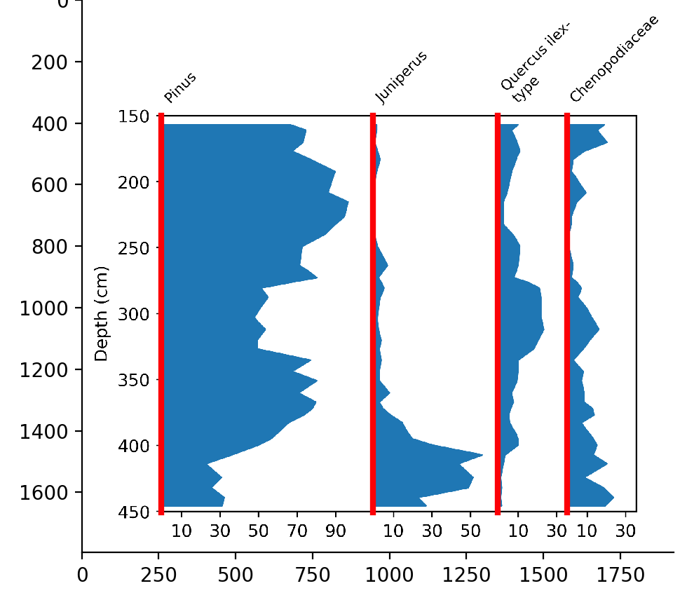

Selecting the columns
=====================
The next step is, to separate the columns, i.e. to tell straditize where each
of the sub diagrams start.

This is simple in our case, since straditize can
separate them automatically.

1. Click the :guilabel:`Column starts` button. You will see several vertical
   blue lines appearing on the plot that you can drag and drop such as you did
   it when selecting the diagram part. You can change their colors using the
   :ref:`marker control <marker-control>`
2. straditize recognizes these columns automatically and in our example, you
   do not have to edit them. Therefore  hit the :guilabel:`Apply` button at the
   bottom of the control and you are done.

.. seealso::

    :ref:`col-starts`
