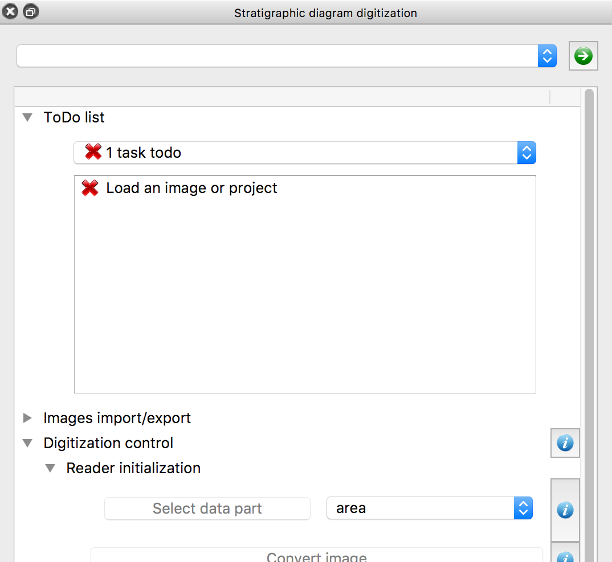

The straditize workflow
=======================

The straditize workflow, i.e. the program for the next few minutes consists of
6 main steps:

1. Load the diagram
2. Select the diagram part (withouth x-axes labels, y-axes labels, etc.)
3. Clean the diagram part. Only the data parts should be left over, i.e. no
   y-axes, lines, letters, etc.
4. Digitize the diagram
5. Find and edit the samples
6. Export the data to Excel or CSV

Most of these tasks can be done in an automatic way but you should always
review and edit the outcome to make sure that what you do is scientifically
reliable.

The interface to these semi-automatic steps is the straditizer control

    Click the image to enlarge it

You can expand the submenus using the |arrow| buttons in the control and you
can access the user manual using the |info| buttons on the right side.

Before we start with the diagram, we will highlight some of the sections in the
GUI:

The ToDo list
    The list at the top of the control guides you through the
    *straditization* process. It shows the open tasks you should consider.

    Most of them will be marked as done automatically, but if you think you are
    done with one of the tasks, just right-click the task and mark it as done.
The Plot control
    This section at the bottom of the control gives you some visual
    explorations of your diagram and the digitization process. You should,
    whenever possible, use it's functionalities, most of the errors can be
    spotted visually
The Help explorer
    This separate widgets can be used to access the user manual and provides
    guidance for the different functionalities. This should always be your
    first point of reference if you have any problems.

.. |info| image:: info.png
    :width: 1.3em
