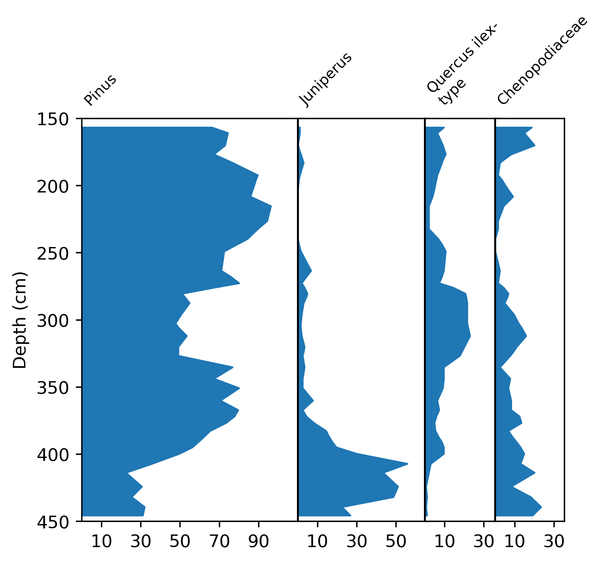

.. _beginner-tutorial:

Beginners tutorial to introduce straditize
==========================================

In this tutorial, we digitize a simple small pollen diagram a subset of the
Hoya del Castillo dataset from [Basil2007a]_. This tutorial will introduce you
into the main parts of straditize and the basic workflow.

At the bottom of the straditizer control, you find a navigation panel which
helps you to navigate through the tutorial. Click the :guilabel:`Next` button
in this control to start the tutorial. You can skip steps by clicking the
:guilabel:`Skip` button and you can check what you have done using the
:guilabel:`Check` button and then proceed with the next step.

The tutorial will take between 5 and 10 minutes. You can save your current
state to a file using :menuselection:`File --> Save --> Save straditizer`
(see :ref:`save-and-load`) and reload it later via
:menuselection:`File --> Open project --> Open straditizer --> Project or image`

If you have questions or troubles with this tutorial, please open an issue on

https://github.com/Chilipp/straditize/issues

and we will do our best to assist you.

.. toctree::
    :numbered: 1
    :hidden:

    beginner-tutorial-control.rst
    beginner-tutorial-load-image
    beginner-tutorial-plot-navigation
    beginner-tutorial-select-data
    beginner-tutorial-create-reader
    beginner-tutorial-column-starts
    beginner-tutorial-clean-image
    beginner-tutorial-digitize
    beginner-tutorial-samples
    beginner-tutorial-yaxis-translation
    beginner-tutorial-xaxis-translation
    beginner-tutorial-column-names
    beginner-tutorial-finish

References
----------
.. [Basil2007a] Davis, Basil A. S., and A. C. Stevenson. "The 8.2ka Event and
   Early-Mid Holocene Forests, Fires and Flooding in the Central Ebro Desert,
   NE Spain." Quat. Sci. Rev. , vol. 26, no. 13-14, 2007, pp. 1695-712,
   `doi:10.1016/j.quascirev.2007.04.007 <https://dx.doi.org/10.1016/j.quascirev.2007.04.007>`__.
