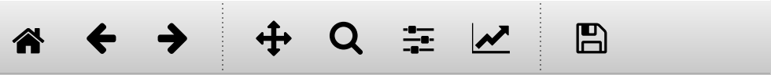

Navigation inside the plot
==========================

Now you see the stratigraphic diagram (by default) centered at the top of the
graphical user interface. Additionally you find a separate window to it's
right with a magnified version of the diagram. It follows your mouse movements
inside the diagram and shows you a magnified version of it.

To navigate inside the plot, you can use the default navigation toolbar that
is provided by matplotlib

Especially the Pan/Zoom button |pan| and the zoom-to-rectangle button |zoom|
are of interest for you. You can enable and disable them by clicking on the
corresponding button in the toolbar.

The `matplotlib docs`_ provide further guidance:

The ``Pan/Zoom`` button
    This button has two modes: pan and zoom.  Click the toolbar button
    to activate panning and zooming, then put your mouse somewhere
    over an axes.  Press the left mouse button and hold it to pan the
    figure, dragging it to a new position.  When you release it, the
    data under the point where you pressed will be moved to the point
    where you released.  If you press 'x' or 'y' while panning the
    motion will be constrained to the x or y axis, respectively.  Press
    the right mouse button to zoom, dragging it to a new position.
    The x axis will be zoomed in proportionately to the rightward
    movement and zoomed out proportionately to the leftward movement.
    The same is true for the y axis and up/down motions.  The point under your
    mouse when you begin the zoom remains stationary, allowing you to
    zoom in or out around that point as much as you wish.  You can use the
    modifier keys 'x', 'y' or 'CONTROL' to constrain the zoom to the x
    axis, the y axis, or aspect ratio preserve, respectively.

    With polar plots, the pan and zoom functionality behaves
    differently.  The radius axis labels can be dragged using the left
    mouse button.  The radius scale can be zoomed in and out using the
    right mouse button.

The ``Zoom-to-rectangle`` button
    Click this toolbar button to activate this mode.  Put your mouse somewhere
    over an axes and press a mouse button.  Define a rectangular region by
    dragging the mouse while holding the button to a new location.  When using
    the left mouse button, the axes view limits will be zoomed to the defined
    region.  When using the right mouse button, the axes view limits will be
    zoomed out, placing the original axes in the defined region.

More information can be found in the matplotlib documentation:
https://matplotlib.org/users/navigation_toolbar.html

.. _matplotlib docs: https://matplotlib.org/users/navigation_toolbar.html
