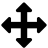

Select the diagram part
=======================
The second step involves selecting the diagram part. This is the part where
your data is displayed, but without the vertical and horizontal axes
descriptions.

Being exact in this step significantly reduces the later work and simplifies
the automatic digitization.

1. Click the :guilabel:`Select data part` button in the digitization control.
2. Straditize automatically recognizes the data part. But you can change this
   by moving the crosses around with your mouse (see the note below).
3. Click the :guilabel:`Apply` button at the bottom
4. Done! You now see a red rectangle in your diagram the marks the data part.
   You can hide it using the `Plot control` section in the straditizer control.
   For the sake of this tutorial, expand the `Plot control` section and remove
   the rectangle by clicking the |invalid| icon for the `Diagram part`

.. note::

    These marks are very common in straditize. In general, you can
    left-click on a mark to move it around, right-click to delete it, and
    Shift+left-click on the plot to create a new one.

    Note that you need to disable the |pan| and |zoom| tools in the navigation
    to interact with the marks, by clicking on the corresponding button!

    If you want to change the appearance of the marks, see the `Marker control`
    section in the straditizer control panel.

 .. |invalid| image:: invalid.png
     :width: 1.3em

