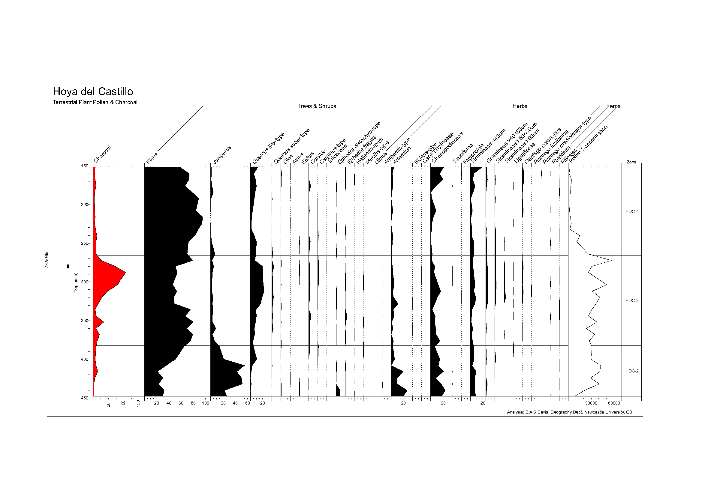

.. _area-tutorial:

Tutorial for digitizing a pollen diagram
========================================

In this tutorial, we digitize a stratigraphic diagram based on the data in
[Basil1980]_ and introduce to you how to extract the samples out of an area
diagram.

At the bottom of the straditizer control, you find a navigation panel which
helps you to navigate through the tutorial. Click the :guilabel:`>` button in
this control to start the tutorial. You can skip steps by clicking the
:guilabel:`Skip` button and you can check what you have done using the
:guilabel:`Check` button and then proceed with the next step.

The tutorial will take between 15 and 30 minutes. You can save your current
state to a file using :menuselection:`File --> Save --> Save straditizer`
(see :ref:`save-and-load`) and reload it later via
:menuselection:`File --> Open project --> Open straditizer --> Project or image`

If you have questions or troubles with this tutorial, please open an issue on

https://github.com/Chilipp/straditize/issues

and we will do our best to assist you.

.. note::

    To not distract you, we will lock the Help explorer. If you want to unlock
    it, simply click the |lock| button above the help.

.. |lock| image:: lock.png
    :width: 1.3em

.. toctree::
    :hidden:
    :numbered:

    straditize_tutorial_load_image
    straditize_tutorial_select_data
    straditize_tutorial_create_reader
    straditize_tutorial_column_starts
    straditize_tutorial_column_names
    straditize_tutorial_remove_lines
    straditize_tutorial_digitize
    straditize_tutorial_samples
    straditize_tutorial_yaxis_translation
    straditize_tutorial_xaxis_translation
    straditize_tutorial_meta
    straditize_tutorial_finish

References
----------
.. [Basil1980] Basil's PhD thesis
