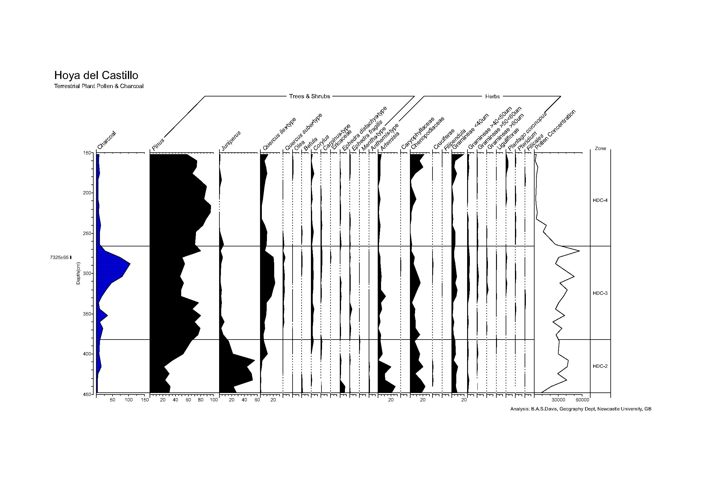

.. _area-tutorial:

Tutorial for digitizing a pollen diagram
========================================

In this tutorial, we digitize a stratigraphic diagram based on the data in
[Basil1980]_ and introduce to you how to extract the samples out of an area
diagram.

In at the bottom of the straditizer control, you find a navigation panel which
helps you to navigate through the tutorial. Click the :guilabel:`>` button in
this control to start the tutorial. You can skip steps by clicking the
:guilabel:`Skip` button and you can check what you have done using the
:guilabel:`Check` button and then proceed with the next step.

.. toctree::
    :hidden:
    :numbered:

    straditize_tutorial_load_image.rst

References
----------
.. [Basil1980] Basil's PhD thesis
