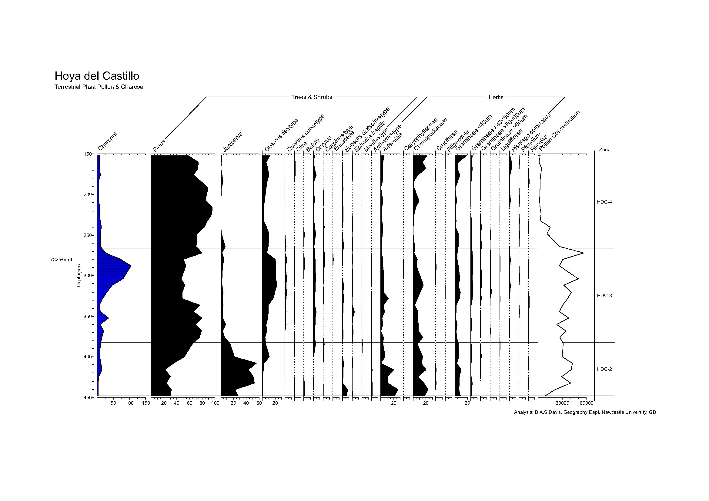

.. _area-tutorial:

Advanced tutorial: The Hoya del Castillo pollen diagram
=======================================================

In this tutorial, we digitize a stratigraphic diagram based on the data in
[Basil2007]_ and introduce to you how to extract the samples out of an area
diagram.

At the bottom of the straditizer control, you find a navigation panel which
helps you to navigate through the tutorial. Click the :guilabel:`Next` button
in this control to start the tutorial. You can skip steps by clicking the
:guilabel:`Skip` button and you can check what you have done using the
:guilabel:`Check` button and then proceed with the next step.

The tutorial will take between 15 and 30 minutes. You can save your current
state to a file using :menuselection:`File --> Save --> Save straditizer`
(see :ref:`save-and-load`) and reload it later via
:menuselection:`File --> Open project --> Open straditizer --> Project or image`

If you have questions or troubles with this tutorial, please open an issue on

https://github.com/Chilipp/straditize/issues

and we will do our best to assist you.

.. toctree::
    :numbered: 1
    :hidden:

    hoya-del-castillo-tutorial-load-image
    hoya-del-castillo-tutorial-select-data
    hoya-del-castillo-tutorial-create-reader
    hoya-del-castillo-tutorial-column-starts
    hoya-del-castillo-tutorial-column-names-ocr
    hoya-del-castillo-tutorial-remove-lines
    hoya-del-castillo-tutorial-digitize
    hoya-del-castillo-tutorial-samples
    hoya-del-castillo-tutorial-yaxis-translation
    hoya-del-castillo-tutorial-xaxis-translation
    hoya-del-castillo-tutorial-meta
    hoya-del-castillo-tutorial-finish

References
----------
.. [Basil2007] Davis, Basil A. S., and A. C. Stevenson. "The 8.2ka Event and
   Early-Mid Holocene Forests, Fires and Flooding in the Central Ebro Desert,
   NE Spain." Quat. Sci. Rev. , vol. 26, no. 13-14, 2007, pp. 1695-712,
   `doi:10.1016/j.quascirev.2007.04.007 <https://dx.doi.org/10.1016/j.quascirev.2007.04.007>`__.
