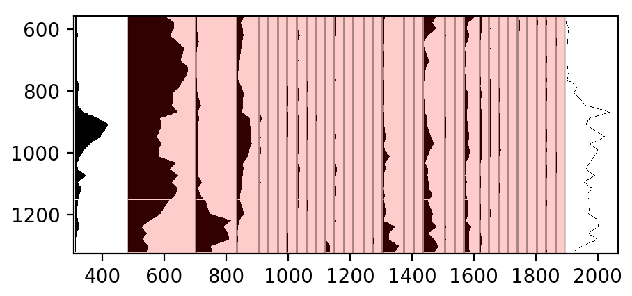

Translating the x-axes
======================
Additionally to the vertical axis, we have to tell straditize how to interprete
the x-axes of the stratigraphic diagram.

Here we have to deal different units of the x-axes in the diagrams. The first
(`Charcoal`) and last (`Pollen Concentration`) columns are counts, the pollen
taxa in between are in percent.

Therefore we will create column specific readers, one for the first and one
for the last column. Then we will insert the x-axis data.

The steps down below are repetitive, but we will describe them for each step
in detail.

The `Charcoal` column
---------------------
1. Expand the `Current reader` tab in the digitization control
2. Click the :guilabel:`+` button to start the selection for a new reader
3. Click in the plot on the first column. It will turn red

   .. image:: charcoal-column.png

4. Click the :guilabel:`Apply` button and select the `area` reader in the
   appearing dialog
5. In the dropdown menu in the `Current reader` tab, select the reader for
   *Column 0* to make it the current reader.

Now, we select the values for interpreting the x-axis of this column. The
procedure is more or less the same, as before with the y-axis:

1. Click the :guilabel:`Insert X-axis values` button in the `Axes translations`
   section of the straditizer control
2. A small dialog will appear where you should enter the x-value of the start
   of the column (here ``0``).

   .. note::

        The dialog only appears, if the start of one of the selected columns is
        visible. If this is not the case, Shift-Leftclick on the plot to
        create a mark.
3. After hitting the :guilabel:`Ok` button, you will see a mark on the plot
   (blue line). You can select the mark via leftclick and drag it to a
   different location or you can delete it via rightclick.
4. now repeat steps 2-4 on a second point in the same column. Your diagram
   should now look something like this:

   .. image:: select-x0-col0.png

5. Click the :guilabel:`Apply` button at the bottom of the straditizer control
   and we can continue with the last column

The `Pollen Concentration` column
---------------------------------
1. In the `Current reader` dropdown menu, select the reader for the columns
   1-27
2. Click the :guilabel:`+` button to start the selection for a new reader
3. Click in the plot on the last column. It will turn red

   .. image:: pollen-concentration-column.png

4. Click the :guilabel:`Apply` button and select the `line` reader
   in the appearing dialog.
5. In the dropdown menu in the `Current reader` tab, select the reader for
   *Column 27* to make it the current reader.

Now, we select the values for interpreting the x-axis of this column. The
procedure is the same as above:

1. Click the :guilabel:`Insert X-axis values` button in the `Axes translations`
   section of the straditizer control
2. In the appearing dialog, enter the x-value of the column start (here again
   ``0``) or Shift-Leftclick on the plot and then enter it (see note above).
3. After hitting the :guilabel:`Ok` button, you will see a mark on the plot
   (blue line). Again, you can select the mark, drag it or delete it as before.
4. now repeat steps 2-4 on a second point in the same column. Your diagram
   should now look something like this:

   .. image:: select-x0-col27.png

5. Click the :guilabel:`Apply` button at the bottom of the straditizer control
   and we can continue with the pollen taxa.

The pollen taxa columns
-----------------------
Last but not least, we translate the x-axes informations for the pollen taxa.

Luckily, as it is common for pollen diagrams, they all have the same scaling.
Therefore it is enough to perform the above steps just for one of the columns.

1. In the dropdown menu in the `Current reader` tab, select the reader for
   *Columns 1-26* to make it the current reader.
2. Click the :guilabel:`Insert X-axis values` button in the `Axes translations`
   section of the straditizer control
3. In the appearing dialog, enter the x-value of the column start (here again
   ``0``) or Shift-Leftclick on the plot and then enter it (see note above).
4. After hitting the :guilabel:`Ok` button, you will see a mark on the plot
   (blue line). Again, you can select the mark, drag it or delete it as before.
5. now repeat steps 2-4 on a second point in the same column. Your diagram
   should now look something like this:

   .. image:: select-x0-col1-26.png

6. Click the :guilabel:`Apply` button at the bottom of the straditizer control.
